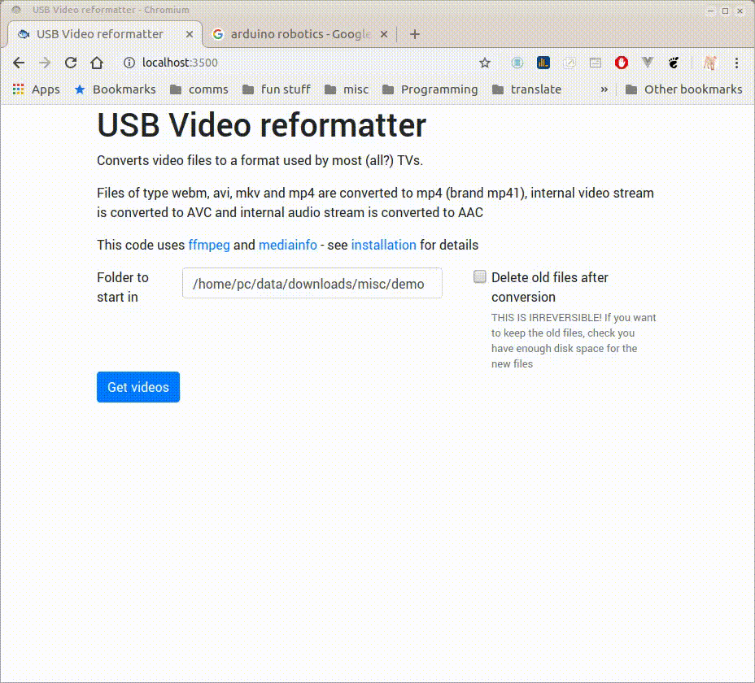

# a php video reformatter

## problem - how to get usb files to work on any TV

I tried to play my usb video files on a TV in a hotel recently and had the usual frustration of finding which files would play. Some would play on the lounge TV, others on the bedroom TV. Some would play video and not sound, others would do the opposite. :tired_face:

Also, I've had it with trying to figure out foreign language remote controls.

Sooooo, to fix this I did the following:

## remote control solution
1. I researched the web for my phone model and '[IR Blaster](https://en.wikipedia.org/wiki/Infrared_blaster)' - my phone has it. Whoop!
2. I downloaded a couple of remote control apps (I use [mi](https://play.google.com/store/apps/details?id=com.duokan.phone.remotecontroller) and [sure](https://play.google.com/store/apps/details?id=com.tekoia.sure.activities), they have a near-identical setup and layout) - I found some IR devices can be found in one database but not the other. YMMV. This means I now learn only one remote control, and it's in english.

## file format solution
I then converted all my favorite video watching to the most common TV format using this code.

I've done a (little) bit of research and the state of my knowledge is as follows:

1) the file name (mkv, mp4, webm etc) is just a container.

2) the video and audio format inside the container is the more important bit, and they can be coded to different standards. This is why sometimes the video plays but the audio doesn't etc.

So as I understand it the most widely playable formats for TV usb seem to be as follows:

* container: mp4 (mp41 brand)
* video: h.264/AVC
* audo: AAC

Feel free to criticize/comment on my (lack of) understanding.

Hence I wrote the app to recursively find all video files on my usb, then check the contents for both video and audio formats, then run ffmpeg to convert the codecs/containers where necessary.

## requirements

this is built on a linux box (Ubuntu mate 18.04) with the following installed:

* ffmpeg
    * used in this way: `ffmpeg -i yourfilename -c:v libx264 -c:a aac -brand mp41 new_file_name.mp4`
* mediainfo
    * used in this way: `mediainfo --Output=XML yourfilename`
* php 7.x

(I know there are php wrappers for [ffmpeg](https://github.com/PHP-FFMpeg/PHP-FFMpeg) and [mediainfo](https://github.com/mhor/php-mediainfo) but I decided they were [overkill](https://www.youtube.com/watch?v=6XUeB3eO9qU) for what I needed.)

## installation

* copy the files into  a directory of your choice
* this is meant to be run as a local app with the input of options etc under your direct supervision. If you want to adapt this for web use in some way then do not rely on `escapeshellcmd()` and `escapeshellarg()` to sanitize your input!

## operation

* Use terminal/console/command line and go to the folder containing your downloaded files
* type `php -S localhost:4567`
* type `localhost:4567` in your browser address bar
* enter the folder containing your videos. The code will automatically check folders inside folders.
* decide if you want the old files deleting. THIS IS IRREVERSIB
* if the file container is already mp4 but changes have to be made inside, the new file will be called `yourfile.new.mp4`

## version history
* 3.0.0 added simple frontend built with web components and a bit of bootstrap 4
* 2.0.0 refactored into classes
* 1.0.0 proof of concept

## extra tips

* A top tip for getting round the TV foreign language interaction is to turn the set on and **then** plug in the USB. If it's recognized you should get something logical to press on screen.

* I plug my USB into the end of a 0.5m bright blue USB extension cable (approx a buck fifty?) and then plug that into the USB at the back of the TV. The cable then dangles down below and in front of the set. This means I'm more likely to remember the USB when speed-packing for the airport and I give the room a final sweep.

* Once you've got your phone set up as a remote, you can control any IR-controlled device, such as the a/c in a certain brand of well-known coffee shops. The [sure](https://play.google.com/store/apps/details?id=com.tekoia.sure.activities) app even has an a/c scanner if you can't work out the brand of a/c. Or maybe you just want to fast-forward someone else's presentation? Just trying to be helpful...

* [youtube-dl](https://rg3.github.io/youtube-dl/) (there's a [gui version](https://mrs0m30n3.github.io/youtube-dl-gui/) available) is the weapon of choice for downloading clips from YouTube, but doesn't guarantee containers will be in mp41 format (as I found out on my last trip. Grrrr....). This code should fix that for you.

* I'm probably stating the obvious here, but you have formatted your USB drive to FAT32 right?...

Help yourself to the code, and if it's of any use then a star would be nice (top right...)